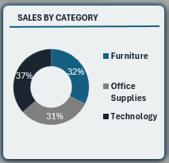
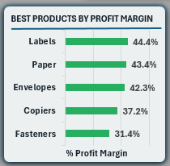
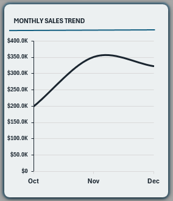
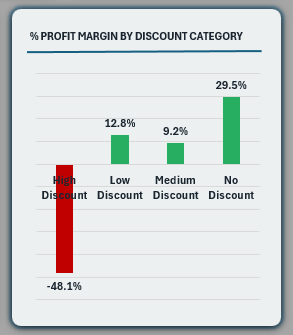

# 📊 Sales Performance Dashboard  

## 📌 Overview  
Interactive Excel dashboard analyzing **4 years of retail sales data (9,648 transactions)**.  

**Key Achievement:** Identified the business incurs a 48.1% loss due to high discounts of 60% to 80%.

---

## 🎯 Key Metrics  

- **Total Sales:** $2.3M  
- **Total Profit:** $286.3K  
- **Profit Margin:** 12.5%  
- **Total Orders:** 4,977  
- **Period:** 2014–2017  

---

## 📊 Dashboard Components  

### KPI Summary  
  

Tracks Sales, Profit, Orders, and Profit Margin at a glance.

---

## 📈 Key Visualizations  

### 1️⃣ Sales by Region  
  

West leads with $723.8K (32%) of total sales.  
**Insight:** Replicate West’s strategy in underperforming regions.  

---

### 2️⃣ Sales by Category  
  

Balanced revenue distribution across categories with technology products being slightly higher (37%).  

---

### 3️⃣ Profit Margin by Product  
  

Highlights high-margin and loss-making products for optimization.  

---

### 4️⃣ Monthly Sales Trend  
  

Tracks performance trajectory across the fiscal year.  
**Insight:** Dramatic growth spikes occur in **September** and **November**, showing the most significant monthly revenue peaks.  

---

### 5️⃣ Seasonality Trend (Quarterly)  
  

Q4 drives $874.7K (38%) of total revenue, confirming a strong end-of-year seasonal push.  

---

### 6️⃣ Top Customers  
  

Top 5 customers contribute 3.4% of total orders.  

---

### 7️⃣ Discount Analysis 🚨  
  

High discounts of 60%–80% result in **–48.1% profit margin**.  
**Recommendation:** Cap discounts at 20% (Low to Medium discount).  

---

## 🛠 Technical Highlights  

- Cleaned dataset (removed 346 duplicates)  
- 7 interconnected Pivot Tables  
- Shared slicers for dynamic filtering  
- KPI-driven dashboard layout  

---

## 🚀 How to Use  
1.[Download Excel Dashboard (Compressed)](Dashboard/Superstore%20Sales%20Performance%20Dashboard%20v2.zip)  
2. Use Year & Quarter slicers to explore insights  
